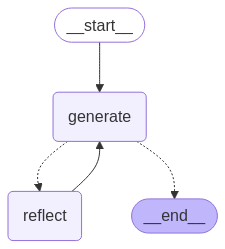

# Reflection Agent

Este projeto utiliza **LangChain**, **LangGraph** e modelos de IA (como Gemini e Anthropic) para criar um agente que gera, reflete e melhora tweets com base em entradas fornecidas. Ele é projetado para ajudar influenciadores e criadores de conteúdo a otimizar suas postagens no Twitter.

---

## **O que o código faz**

1. **Geração de Tweets**:
   - O nó de geração (`generation_node`) cria uma versão inicial de um tweet com base em uma entrada fornecida.

2. **Reflexão e Análise**:
   - O nó de reflexão (`reflection_node`) avalia o tweet gerado, oferecendo recomendações detalhadas para melhorias.

3. **Iterações**:
   - O fluxo alterna entre geração e reflexão até atingir uma condição de parada (6 mensagens no estado).

4. **Resultado Final**:
   - O tweet final é extraído e apresentado como pronto para publicação.

---

## **Visualização do Fluxo**

Abaixo está uma representação visual do fluxo do agente:



---

## **Pré-requisitos**

- **Python**: Versão 3.10 ou superior.
- **Poetry**: Para gerenciar dependências.

---

## **Configuração**

1. **Clone o repositório**:
   ```bash
   git clone https://github.com/RayBasilio123/reflection-agent.git
   cd reflection-agent

   ```

2. **Instale as dependências**:
   ```bash
   poetry install
   ```

3. **Configure as variáveis de ambiente**:
   - Crie um arquivo `.env` na raiz do projeto e defina as variáveis de ambiente necessárias:
     ```
     OPENAI_API_KEY=your_openai_api_key
     GOOGLE_API_KEY=your_google_api_key
     ANTHROPIC_API_KEY=your_anthropic_api_key
     GOOGLE_APPLICATION_CREDENTIALS=path/to/your/credentials.json

     LANGCHAIN_PROJECT=reflection-agent
     LANGSMITH_TRACING=true
     LANGSMITH_ENDPOINT="https://api.smith.langchain.com"
     LANGSMITH_API_KEY="your_langsmith_api_key"
     LANGSMITH_PROJECT="LangGraph_Teste2"
     ```

---

## **Execução**

Certifique-se de que o arquivo de credenciais JSON está no local correto: O caminho para o arquivo JSON deve ser configurado na variável GOOGLE_APPLICATION_CREDENTIALS no .env.

1. *Ative o ambiente virtual:*
""
poetry shell
"""

2. **Executar o aplicativo**:
   ```bash
   python main.py
   ```

---
3. **Fluxo de Funcionamento**
Entrada Inicial:

O usuário fornece um tweet original para ser melhorado.
Geração:

O modelo gera uma versão inicial do tweet.
Reflexão:

O modelo avalia o tweet gerado e fornece recomendações.
Iterações:

O processo alterna entre geração e reflexão até atingir a condição de parada.
Resultado Final:

O tweet final é apresentado, incorporando todas as melhorias.

---

## **Referências**

- [OpenAI API](https://platform.openai.com/docs/guides/chat/introduction)
- [Google Cloud API](https://cloud.google.com/natural-language/docs)
- [Anthropic API](https://docsanthropic.com/docs/api/overview)
- [LangChain](https://python.langchain.com/en/latest/index.html)
- [Smith](https://smith-langchain.com/)
- [LangSmith](https://smith-langchain.com/)